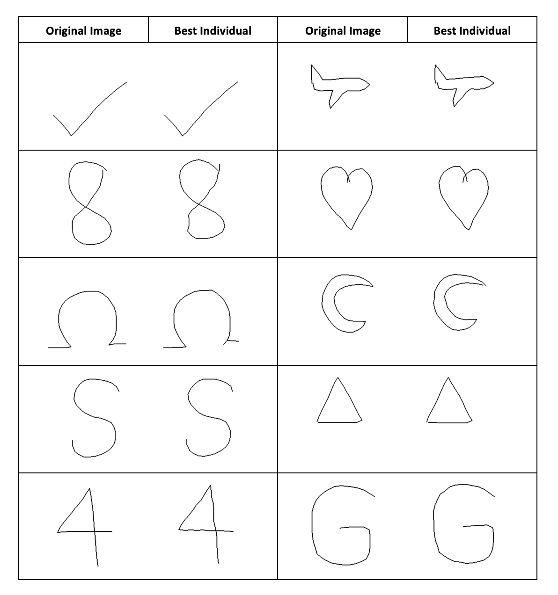

# Image Evolution using Genetic Algorithms

This project utilizes genetic algorithms to evolve images, aiming to generate images that resemble a given target image.

You can simply create your own image using ```paint.py```. After naming your image, change the *img_name* in ```main.py``` and run the program.

You can also change the population size, the maximum number of generations, the mutation rate and the fitness function (euclidean_distance, cosine_similarity, mean_absolute_error) to try outputs with different parameters.

## Example
Here are some outputs for the given images under the *images* folder.
Parameters used for all outputs:
- population size: 200
- the maximum number of generations: 1000
- mutation rate: 0.01
- fitness function: "euclidean_distance"




## Visualization
Here is a visualization of fitness change over generations for an example image.


